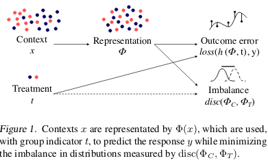

# Learning Representations for Counterfactual Inference

> Paper

[arxiv](https://arxiv.org/abs/1605.03661)

> Implementation

[github](https://github.com/clinicalml/cfrnet)

## TLDR

### Aim

> objectives, contributions

Objective: perform counterfactual inference on data from observational studies (i.e. contextual features, records of interventions and outcomes)

Contributions:

* Formulates counterfactual inference as a domain adaption problem
* Introduces a form of regularization by enforcing similarity between the distributions of representations learned for populations with different interventions.
* Introduces methods for such regularization (Balancing Linear Regression and Deep Neural Networks)
* Derives an upper bound on the regret term in the counterfactual region that is *approximately* minimized using the methods mentioned above.

> context

* In a counterfactual setting, an agent performs actions and receives feedback/reward only for theirs choices (similar to multi-armed bandits). Counterfactual inference from observational data is connected to Reinforcement Learning but here we do not have control and/or partial understanding of the mechanism which decides which actions are performed.

* Note that this is different from classical supervised learning as counterfactual inference has to be performed on a different distribution (counterfactual distribution) than the one from which samples are given (factual distribution). As a result, it conflicts with the *i.i.d.* hypothesis made in classical machine learning since the test set features distribution is no longer the same as the training set features distribution.

### Methods

> whats new in their approaches

Their method consists in learning two key elements:

1. a representation $\phi : X \mapsto \RR^d$ (using a Deep Neural Network or Feature Reweighting + Selection)
2. a hypothesis $h : \RR^d \times T \mapsto \RR$ (see it as a classifier)

such that the learned representation trades-off 3 objectives:

1. Low-error prediction of the observed outcome over the factual representation (error minimization on train set + regularization for generalization)
2. Enable low-error prediction of unobserved counterfactuals by taking into account relevant factual outcomes (counterfactual prediction has to be close to the nearest observed outcome from treated/control)
3. Distributions of treatment populations are similar/balanced (using discrepancy distance between distributions so as to prevent using *unreliable* aspects of data)

Note: in that setting (i.e. using discrepancy distance), only linear functions $h$ that map the representation space $\RR^d$ times the treatment set $T$ to $\RR$ can produce a closed-form formula.

### Technical details

> mathematical notations, proofs

The authors provide a theorem that derives an upper bound on the relative counterfactual generalization error that can be measured directly from the data granted a series of assumptions.

> setups

In terms of Deep Neural Networks architecture, they use:

* Fully Connected ReLU layers
* RMSProp
* Light $l_2$ weight decay: $\lambda = 1e-3$
* From 25 to 400 (and 200 in output layers) hidden units depending on the dataset

1. Balanced Neural Network (BNN) 4-0 (meaning 4 representation layers and a single linear output layer)
2. BNN 2-2 (meaning 2 representation layers and two ReLU output layers combined with a linear output layer)

> parameterizing

* Standard methods for hyperparameter selection, including cross-validation, are unavailable when training counterfactual models on real-world data, as there are no samples from the counterfactual outcome by definition.

### Experiments - results

> comparable experiments on typical dataset/environments...

* They use synthetic datasets to evaluated their methods
* They use a variety of baselines such as: Ordinary Least Squares, Doubly Robust Linear Regression (using propensity score obtained via Logistic regression), LASSO + RIDGE, BART (regression trees) and a 2-2 feed-forward neural network without the distributions similarity regularization term.

> breakthroughs

* They obtain state-of-the-art performances on both dataset.
* The experimental results indicate that the discrepancy term/regularization is useful to avoid overfitting the representation to the factual outcome only.

### My thoughts and takeaways

> pros

* Provide a new algorithmic framework for counterfactual inference inspired by domain adaptation.
* Comprehensive introduction to get up to speed on counterfactual inference
* Counterfactual Regressor implementation available on GitHub (see link at the top)

> cons

* Some more expressive distribution discrepancy regularizers are missing (developped in their next [paper](https://arxiv.org/abs/1606.03976)))
* Only synthetic datasets (else we cannot evaluate...)

> related stuff

The authors mention that causal inference is generally hard when there is not much overlap between the treatment and control groups.

They also mention other methods:

* Non-parametric methods (i.e. no modelling of context, intervention and outcome relations): Nearest Neighbor matching, propensity score matching and propensity score re-weighting
* Parametric methods: Linear, logistic regression, random forests, regression trees
* Doubly robust: only good when the true treament assignement probability is known.

## Top Figures

> 

## Metadata

> easily grep-able data: tags, reading depth
> bibtex: author list, title, published year, journal, URL, etc

Frederik D. Johansson, Uri Shalit, David Sontag, arXiv:1605.03661v3, published in ICML 2016
